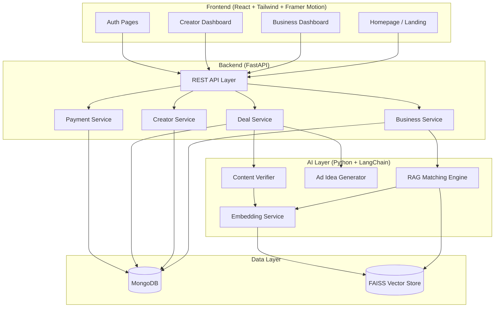
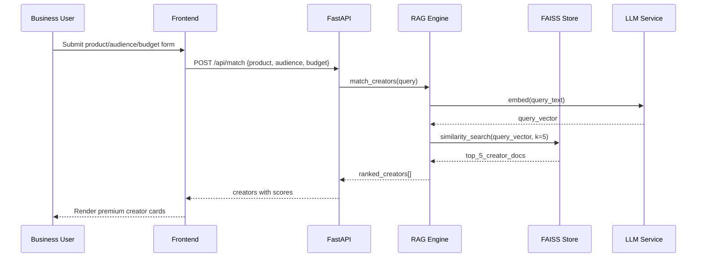
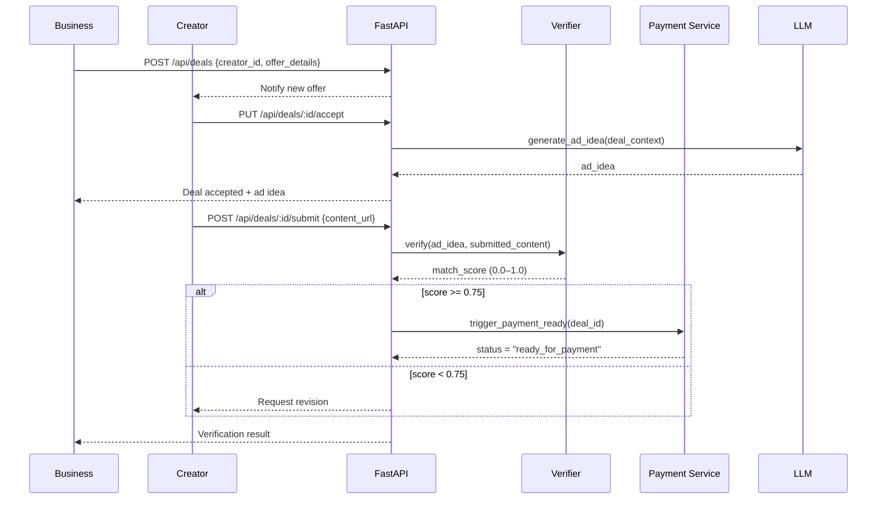

# Design Document: CreatorConnectAI

## Overview

CreatorConnectAI is a premium AI-powered full-stack web platform that intelligently connects businesses with content creators. It leverages a RAG (Retrieval-Augmented Generation) pipeline backed by FAISS vector search to match brands with the most relevant creators, automates deal workflows from offer creation through content verification, and triggers a blockchain-ready payment state upon successful content validation. The platform is designed with an Apple-inspired aesthetic — minimal, dark, and premium — built on React + Tailwind CSS + Framer Motion on the frontend and FastAPI + Python AI services on the backend.

The system serves two primary user personas: Businesses (brands seeking creators) and Creators (influencers/content producers). Each has a dedicated dashboard. The AI layer handles three core tasks: semantic creator matching via RAG, ad idea generation via LLM, and content verification via similarity scoring.

The entire experience prioritizes visual polish, smooth animations, generous whitespace, and a dark neutral color palette (#0B0B0C background, #FFFFFF primary text, #8E8E93 accent) that evokes a premium SaaS product.

---

## Architecture



---

## Sequence Diagrams

### Creator Matching Flow



### Deal Lifecycle Flow



---

## Components and Interfaces

### Frontend Components

#### `HeroSection`
**Purpose**: Full-screen landing hero with animated gradient, floating UI cards, and CTAs.

**Interface**:
```typescript
interface HeroSectionProps {
  onBusinessCTA: () => void
  onCreatorCTA: () => void
}
```

**Responsibilities**:
- Render animated dark gradient background
- Display floating creator profile cards with Framer Motion entrance animations
- Render headline, subtext, and dual CTA buttons

#### `CreatorCard`
**Purpose**: Premium card displaying creator profile, stats, and action button.

**Interface**:
```typescript
interface CreatorCardProps {
  creator: Creator
  matchScore?: number
  onSendOffer?: (creatorId: string) => void
  variant: 'showcase' | 'match-result'
}
```

**Responsibilities**:
- Display avatar, name, niche, follower count, engagement rate
- Show match score badge when in match-result variant
- Trigger offer modal on button click

#### `BusinessDashboard`
**Purpose**: Form + results view for business users to find and engage creators.

**Interface**:
```typescript
interface BusinessDashboardProps {
  user: BusinessUser
}
```

**Responsibilities**:
- Render product/audience/budget input form
- Submit to matching API and display results
- Manage offer creation flow

#### `CreatorDashboard`
**Purpose**: Offer management view for creators.

**Interface**:
```typescript
interface CreatorDashboardProps {
  user: CreatorUser
}
```

**Responsibilities**:
- Fetch and display incoming offers
- Handle accept / reject / counter actions
- Show deal status timeline

#### `OfferCard`
**Purpose**: Card showing offer details with action buttons.

**Interface**:
```typescript
interface OfferCardProps {
  deal: Deal
  onAccept: (dealId: string) => void
  onReject: (dealId: string) => void
  onCounter: (dealId: string, counterOffer: CounterOffer) => void
}
```

### Backend Services

#### `MatchingService`
**Purpose**: Orchestrates RAG-based creator retrieval.

**Interface**:
```typescript
class MatchingService {
  match_creators(query: MatchQuery): Promise<RankedCreator[]>
  embed_query(text: string): Promise<number[]>
}
```

#### `DealService`
**Purpose**: Manages full deal lifecycle.

**Interface**:
```typescript
class DealService {
  create_deal(business_id: string, creator_id: string, offer: Offer): Promise<Deal>
  update_status(deal_id: string, status: DealStatus): Promise<Deal>
  submit_content(deal_id: string, content_url: string): Promise<VerificationResult>
}
```

#### `VerificationService`
**Purpose**: Compares ad idea against submitted content.

**Interface**:
```typescript
class VerificationService {
  verify(ad_idea: string, submitted_content: string): Promise<VerificationResult>
  compute_similarity(vec_a: number[], vec_b: number[]): number
}
```

#### `PaymentService`
**Purpose**: Manages payment state transitions (blockchain-ready mock).

**Interface**:
```typescript
class PaymentService {
  trigger_payment_ready(deal_id: string): Promise<PaymentRecord>
  get_payment_status(deal_id: string): Promise<PaymentStatus>
}
```

---

## Data Models

### `Creator`
```typescript
interface Creator {
  id: string
  name: string
  avatar_url: string
  niche: string[]           // e.g. ["tech", "lifestyle"]
  platform: string          // "instagram" | "youtube" | "tiktok"
  followers: number
  engagement_rate: number   // 0.0–1.0
  bio: string
  portfolio_url?: string
  embedding?: number[]      // stored in FAISS, not returned to client
}
```

**Validation Rules**:
- `engagement_rate` must be between 0.0 and 1.0
- `followers` must be a positive integer
- `niche` must contain at least one entry

### `BusinessUser`
```typescript
interface BusinessUser {
  id: string
  company_name: string
  email: string
  industry: string
  created_at: Date
}
```

### `MatchQuery`
```typescript
interface MatchQuery {
  product_description: string   // min 10 chars
  target_audience: string       // min 5 chars
  budget: number                // positive number, USD
  top_k?: number                // default 5
}
```

### `Deal`
```typescript
interface Deal {
  id: string
  business_id: string
  creator_id: string
  offer_amount: number
  deliverables: string
  deadline: Date
  status: DealStatus
  ad_idea?: string
  content_url?: string
  verification_score?: number
  payment_status?: PaymentStatus
  created_at: Date
  updated_at: Date
}

type DealStatus = 
  | 'pending'
  | 'accepted'
  | 'rejected'
  | 'countered'
  | 'content_submitted'
  | 'verified'
  | 'revision_requested'
  | 'completed'

type PaymentStatus = 
  | 'not_triggered'
  | 'ready_for_payment'
  | 'processing'
  | 'paid'
```

### `VerificationResult`
```typescript
interface VerificationResult {
  deal_id: string
  match_score: number       // 0.0–1.0
  threshold: number         // default 0.75
  passed: boolean           // match_score >= threshold
  feedback: string
}
```

### `PaymentRecord`
```typescript
interface PaymentRecord {
  id: string
  deal_id: string
  amount: number
  status: PaymentStatus
  blockchain_tx_hash?: string   // mock value
  triggered_at: Date
}
```

---

## Algorithmic Pseudocode

### RAG Creator Matching Algorithm

```pascal
ALGORITHM match_creators(query)
INPUT: query of type MatchQuery
OUTPUT: ranked_creators of type RankedCreator[]

PRECONDITIONS:
  - query.product_description is non-empty string
  - query.target_audience is non-empty string
  - query.budget > 0
  - FAISS index is initialized and populated

POSTCONDITIONS:
  - Returns list of 1 to top_k creators sorted by similarity score descending
  - Each creator has a match_score in range [0.0, 1.0]

BEGIN
  // Step 1: Build composite query text
  query_text ← CONCAT(
    "Product: ", query.product_description, " ",
    "Audience: ", query.target_audience, " ",
    "Budget: ", query.budget
  )

  // Step 2: Embed query
  query_vector ← embedding_model.embed(query_text)
  ASSERT LENGTH(query_vector) = EMBEDDING_DIM

  // Step 3: Retrieve from FAISS
  top_k ← query.top_k OR 5
  results ← faiss_index.similarity_search_with_score(query_vector, top_k)

  // Step 4: Normalize and rank
  ranked_creators ← []
  FOR each (doc, raw_score) IN results DO
    ASSERT raw_score >= 0
    normalized_score ← 1 / (1 + raw_score)   // convert L2 distance to similarity
    creator ← database.get_creator(doc.metadata.creator_id)
    ranked_creators.append({creator, match_score: normalized_score})
  END FOR

  // Step 5: Sort descending by match_score
  ranked_creators ← SORT(ranked_creators, BY match_score, ORDER descending)

  ASSERT LENGTH(ranked_creators) <= top_k
  RETURN ranked_creators
END
```

**Loop Invariant**: At each iteration, `ranked_creators` contains only valid creator objects with normalized scores in [0.0, 1.0].

---

### Content Verification Algorithm

```pascal
ALGORITHM verify_content(ad_idea, submitted_content)
INPUT: ad_idea of type string, submitted_content of type string
OUTPUT: result of type VerificationResult

PRECONDITIONS:
  - ad_idea is non-empty string
  - submitted_content is non-empty string
  - embedding_model is initialized

POSTCONDITIONS:
  - result.match_score is in range [0.0, 1.0]
  - result.passed = (result.match_score >= THRESHOLD)
  - result.feedback is non-empty string

BEGIN
  THRESHOLD ← 0.75

  // Step 1: Embed both texts
  vec_idea ← embedding_model.embed(ad_idea)
  vec_content ← embedding_model.embed(submitted_content)

  ASSERT LENGTH(vec_idea) = LENGTH(vec_content) = EMBEDDING_DIM

  // Step 2: Compute cosine similarity
  dot_product ← DOT(vec_idea, vec_content)
  magnitude_a ← SQRT(SUM(x^2 FOR x IN vec_idea))
  magnitude_b ← SQRT(SUM(x^2 FOR x IN vec_content))

  IF magnitude_a = 0 OR magnitude_b = 0 THEN
    RETURN VerificationResult{match_score: 0.0, passed: false, feedback: "Empty embedding"}
  END IF

  match_score ← dot_product / (magnitude_a * magnitude_b)
  match_score ← CLAMP(match_score, 0.0, 1.0)

  // Step 3: Determine pass/fail and feedback
  passed ← match_score >= THRESHOLD

  IF passed THEN
    feedback ← CONCAT("Content aligns well. Score: ", match_score)
  ELSE
    feedback ← CONCAT("Content needs revision. Score: ", match_score, ". Threshold: ", THRESHOLD)
  END IF

  RETURN VerificationResult{match_score, passed, feedback, threshold: THRESHOLD}
END
```

**Loop Invariant**: N/A (no loops; linear computation).

---

### Deal State Machine

```pascal
ALGORITHM transition_deal_status(deal, action)
INPUT: deal of type Deal, action of type DealAction
OUTPUT: updated_deal of type Deal

PRECONDITIONS:
  - deal.id exists in database
  - action is a valid DealAction
  - transition is valid per state machine rules

POSTCONDITIONS:
  - deal.status is updated to new valid state
  - deal.updated_at is set to current timestamp
  - If new status = 'verified' AND score >= threshold → payment triggered

VALID TRANSITIONS:
  pending     → accepted (action: ACCEPT)
  pending     → rejected (action: REJECT)
  pending     → countered (action: COUNTER)
  accepted    → content_submitted (action: SUBMIT_CONTENT)
  content_submitted → verified (action: VERIFY, score >= 0.75)
  content_submitted → revision_requested (action: VERIFY, score < 0.75)
  revision_requested → content_submitted (action: RESUBMIT)
  verified    → completed (action: COMPLETE)

BEGIN
  current_status ← deal.status
  new_status ← LOOKUP_TRANSITION(current_status, action)

  IF new_status IS NULL THEN
    RAISE InvalidTransitionError(current_status, action)
  END IF

  deal.status ← new_status
  deal.updated_at ← NOW()

  IF new_status = 'verified' THEN
    payment_service.trigger_payment_ready(deal.id)
  END IF

  database.save(deal)
  RETURN deal
END
```

---

## Key Functions with Formal Specifications

### `embed_and_index_creator(creator)`

```pascal
FUNCTION embed_and_index_creator(creator: Creator): void
```

**Preconditions**:
- `creator.id` is unique and non-empty
- `creator.bio`, `creator.niche`, `creator.platform` are non-empty
- FAISS index is initialized

**Postconditions**:
- Creator's composite text is embedded and stored in FAISS
- `creator.id` is stored in FAISS document metadata
- FAISS index size increases by exactly 1

**Loop Invariants**: N/A

---

### `generate_ad_idea(deal_context)`

```pascal
FUNCTION generate_ad_idea(deal_context: DealContext): string
```

**Preconditions**:
- `deal_context.product_description` is non-empty
- `deal_context.creator_niche` is non-empty
- LLM service is available

**Postconditions**:
- Returns non-empty string containing ad concept
- Response is deterministic given same inputs (temperature = 0.3)

**Loop Invariants**: N/A

---

### `compute_cosine_similarity(vec_a, vec_b)`

```pascal
FUNCTION compute_cosine_similarity(vec_a: float[], vec_b: float[]): float
```

**Preconditions**:
- `LENGTH(vec_a) = LENGTH(vec_b) > 0`
- Neither vector is the zero vector

**Postconditions**:
- Returns value in range [-1.0, 1.0]
- Returns 1.0 if and only if vectors are identical
- Returns 0.0 if vectors are orthogonal

**Loop Invariants**:
- During dot product computation: running sum contains only products of valid float pairs

---

## Example Usage

```typescript
// Business submits matching form
const matchResults = await api.post('/api/match', {
  product_description: "Wireless noise-cancelling headphones for professionals",
  target_audience: "Tech-savvy remote workers aged 25-40",
  budget: 5000,
  top_k: 5
})
// Returns: [{ creator: {...}, match_score: 0.94 }, ...]

// Business sends offer to top creator
const deal = await api.post('/api/deals', {
  creator_id: matchResults[0].creator.id,
  offer_amount: 2500,
  deliverables: "1 Instagram Reel + 2 Stories",
  deadline: "2025-03-01"
})
// Returns: { id: "deal_abc", status: "pending", ... }

// Creator accepts offer
await api.put(`/api/deals/${deal.id}/accept`)
// Returns: { status: "accepted", ad_idea: "Show the headphones blocking out..." }

// Creator submits content
const verification = await api.post(`/api/deals/${deal.id}/submit`, {
  content_url: "https://cdn.example.com/content/reel_123.mp4"
})
// Returns: { match_score: 0.87, passed: true, feedback: "Content aligns well..." }

// Payment auto-triggered
// deal.payment_status → "ready_for_payment"
// deal.status → "verified"
```

---

## Correctness Properties

*A property is a characteristic or behavior that should hold true across all valid executions of a system — essentially, a formal statement about what the system should do. Properties serve as the bridge between human-readable specifications and machine-verifiable correctness guarantees.*

### Property 1: Match result count bound

*For any* valid MatchQuery with top_k = N, the number of creators returned by the Matching_Service must be less than or equal to N.

**Validates: Requirements 3.2**

### Property 2: Match score range invariant

*For any* valid MatchQuery, every creator in the returned result list must have a match_score in the range [0.0, 1.0].

**Validates: Requirements 3.4**

### Property 3: Match results sorted descending

*For any* valid MatchQuery, the returned creator list must be sorted in descending order by match_score (each element's score is greater than or equal to the next element's score).

**Validates: Requirements 3.3**

### Property 4: Verification pass/fail threshold

*For any* ad_idea and submitted_content pair, the VerificationResult's `passed` field must be true if and only if `match_score >= 0.75`, and false otherwise.

**Validates: Requirements 6.3, 6.4**

### Property 5: Payment safety invariant

*For any* Deal in the system, `payment_status = "ready_for_payment"` must imply that `deal.status` is `"verified"` or `"completed"`. Payment must never be triggered for a deal that has not been verified.

**Validates: Requirements 7.3**

### Property 6: Deal state machine validity

*For any* Deal and any action applied to it, the resulting status transition must be one of the explicitly defined valid transitions. Any attempt to apply an action that is not valid for the current status must be rejected with HTTP 409.

**Validates: Requirements 5.6, 5.7**

### Property 7: Creator engagement rate range

*For any* Creator profile stored in the system, `engagement_rate` must be in the range [0.0, 1.0]. Any profile submitted with a value outside this range must be rejected with HTTP 422.

**Validates: Requirements 2.2**

### Property 8: Embedding dimension consistency

*For any* text input to the Embedding_Service, the resulting vector must have exactly EMBEDDING_DIM dimensions (1536 for OpenAI, 384 for local model).

**Validates: Requirements 11.1**

### Property 9: Role-based access control

*For any* authenticated user with role R, attempting to access an endpoint restricted to a different role R' must result in HTTP 403, regardless of the specific endpoint or request payload.

**Validates: Requirements 1.4, 1.5**

### Property 10: New deal initial status

*For any* valid deal creation request submitted by a Business_User, the resulting Deal must have status `"pending"`.

**Validates: Requirements 5.1**

### Property 11: Verification result feedback completeness

*For any* call to the Verification_Service, the returned VerificationResult must contain a non-empty feedback string.

**Validates: Requirements 6.7**

### Property 12: Creator indexing increments FAISS count

*For any* Creator profile that is created or updated, the FAISS_Store index size must increase by exactly one, and the creator's embedding must be retrievable by creator_id from the index.

**Validates: Requirements 2.5, 2.6**

### Property 13: Embedding vectors excluded from public API

*For any* public API response containing Creator data, the `embedding` field must be absent or null — embedding vectors must never be exposed to unauthenticated clients.

**Validates: Requirements 10.3**

### Property 14: Offer amount validation

*For any* deal creation request, a non-positive or out-of-range `offer_amount` must be rejected with HTTP 422 by server-side validation.

**Validates: Requirements 13.2**

### Property 15: Content URL domain allowlist

*For any* content submission request, a `content_url` whose domain is not on the trusted CDN allowlist must be rejected with HTTP 422.

**Validates: Requirements 13.3, 13.5**

### Property 16: JWT authentication required

*For any* request to a protected `/api/*` endpoint made without a valid JWT token, the System must return HTTP 401.

**Validates: Requirements 1.3, 1.6**

---

## Error Handling

### Scenario 1: FAISS Index Empty or Unavailable
**Condition**: RAG query executed before any creators are indexed, or FAISS file is missing.
**Response**: Return HTTP 503 with `{ error: "Matching service unavailable", code: "FAISS_NOT_READY" }`
**Recovery**: Admin endpoint `/api/admin/reindex` triggers full re-embedding of all creators.

### Scenario 2: LLM Service Timeout
**Condition**: Ad idea generation or embedding call exceeds 30s timeout.
**Response**: Return cached/fallback ad idea template; log error for monitoring.
**Recovery**: Retry with exponential backoff (max 3 attempts); fall back to template if all fail.

### Scenario 3: Invalid Deal State Transition
**Condition**: Client attempts an action not valid for current deal status (e.g., accepting an already-accepted deal).
**Response**: HTTP 409 with `{ error: "Invalid transition", current_status, attempted_action }`
**Recovery**: Client re-fetches deal state and re-renders UI accordingly.

### Scenario 4: Content Verification Score Edge Cases
**Condition**: Submitted content URL is inaccessible or content is non-text (pure video with no transcript).
**Response**: Return `{ match_score: 0.0, passed: false, feedback: "Content could not be processed" }`
**Recovery**: Creator is prompted to resubmit with a text description or transcript.

### Scenario 5: Embedding Dimension Mismatch
**Condition**: FAISS index built with different model than current embedding service.
**Response**: HTTP 500 with `{ error: "Embedding dimension mismatch" }`
**Recovery**: Trigger full reindex with current model; block matching until complete.

---

## Testing Strategy

### Unit Testing Approach
- Test each service in isolation with mocked dependencies
- Key test cases: `match_creators` with empty query, `verify_content` with identical texts (expect score ≈ 1.0), `verify_content` with unrelated texts (expect score < 0.5), deal state machine transitions (valid and invalid)
- Coverage goal: 80%+ on AI service layer

### Property-Based Testing Approach
**Property Test Library**: `hypothesis` (Python) for backend, `fast-check` (TypeScript) for frontend

Key properties to test:
- For any valid MatchQuery, match_scores are always in [0.0, 1.0]
- For any two identical strings, cosine similarity = 1.0
- For any deal, payment is only triggered when status = "verified"
- For any creator with valid data, embedding always produces vector of correct dimension

### Integration Testing Approach
- End-to-end flow: Submit match query → receive creators → create deal → accept → submit content → verify → check payment status
- Test with seeded FAISS index containing 20 dummy creators
- Validate API contract between frontend and FastAPI using OpenAPI schema

---

## Performance Considerations

- FAISS index loaded into memory at startup; queries are sub-10ms for up to 10,000 creators
- Embedding calls are the primary bottleneck (~200-500ms per call); cache embeddings for repeated queries using Redis or in-memory LRU cache
- Frontend uses React.lazy + Suspense for code splitting; homepage bundle target < 200KB gzipped
- Framer Motion animations use `will-change: transform` and GPU-accelerated properties only
- API responses for creator matching are paginated (default page size: 10)

---

## Security Considerations

- JWT-based authentication for all `/api/*` endpoints except public creator showcase
- Business and Creator roles enforced at API middleware level; creators cannot access business matching endpoints
- Deal amounts validated server-side; client-submitted `offer_amount` must be positive and within configured limits
- Content URLs validated against allowlist of trusted CDN domains before processing
- LLM prompts sanitized to prevent prompt injection; user input never directly interpolated into system prompts
- FAISS index is read-only at runtime; write access only via authenticated admin endpoints

---

## Dependencies

**Frontend**:
- `react` ^18, `react-router-dom` ^6
- `tailwindcss` ^3
- `framer-motion` ^11
- `axios` for API calls
- `lucide-react` for icons

**Backend**:
- `fastapi` ^0.110, `uvicorn`
- `langchain` + `langchain-openai` or `langchain-community`
- `faiss-cpu` (or `faiss-gpu`)
- `sentence-transformers` (local embedding fallback)
- `pymongo` or `motor` (async MongoDB driver)
- `python-jose` for JWT
- `pydantic` v2 for data validation

**Infrastructure**:
- MongoDB Atlas (or local MongoDB)
- OpenAI API (or local model via Ollama)
- Docker + docker-compose for local development
